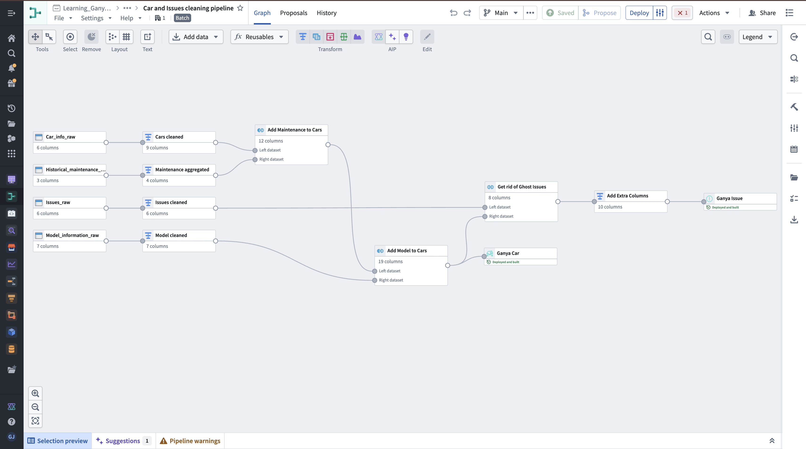
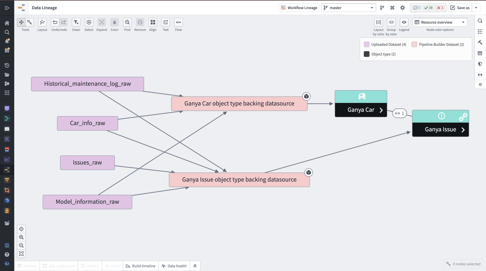
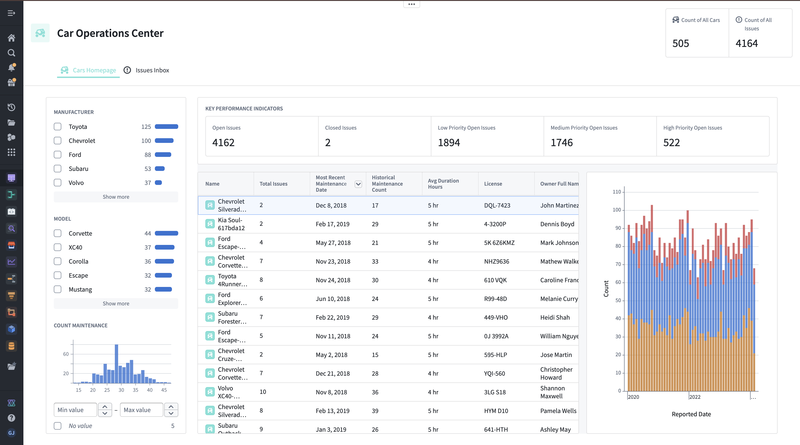
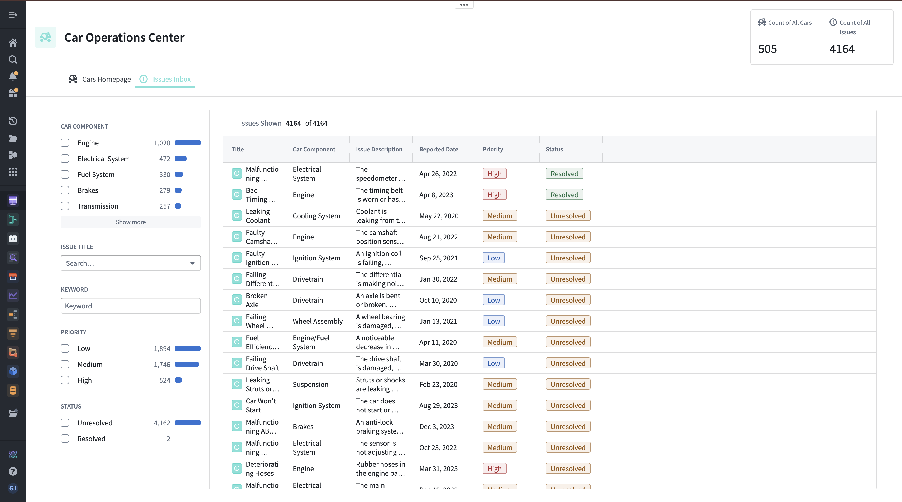
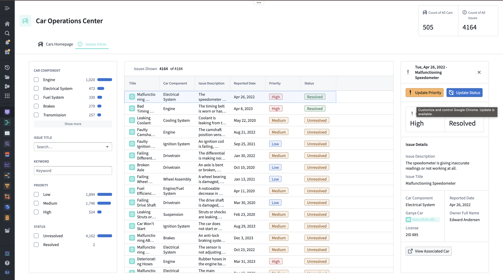
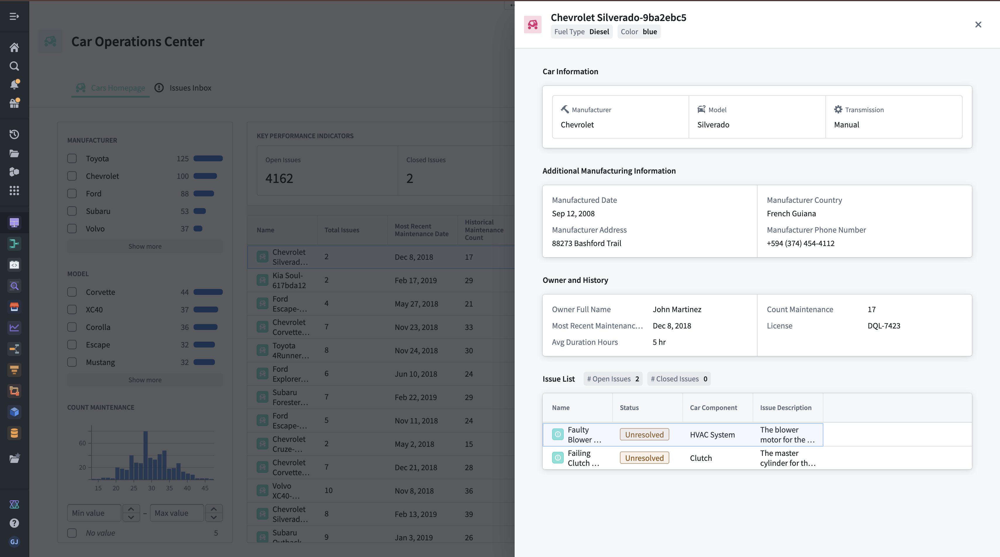
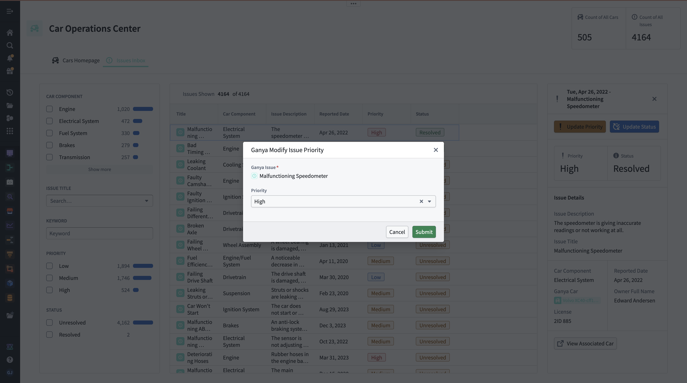
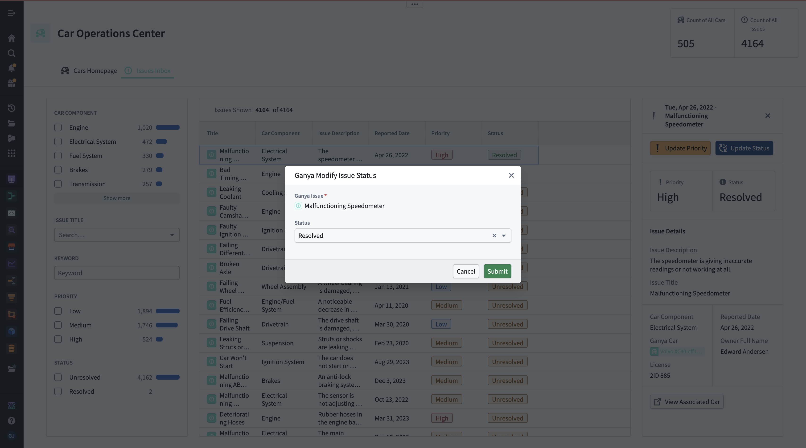
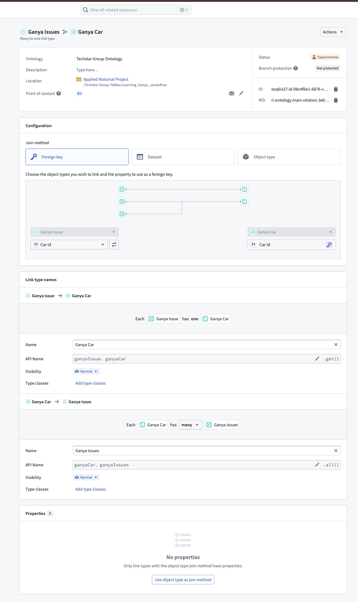

# Operational Data Platform for Fleet & Issue Management

Built an end-to-end operational data platform in Palantir Foundry to manage fleet performance and issue tracking for a car leasing business.

---

## Overview

This project simulates a real-world scenario where operational data is spread across multiple systems and needs to be unified for better visibility and decision-making.

The platform integrates vehicle data, maintenance history, model information, and issue logs into a centralized system. It enables users to monitor fleet performance, track issues, and take action through an interactive application.

---

## Data Flow

Raw Data → Data Transformation → Ontology Modeling → Interactive Application

Raw datasets were cleaned and transformed within Palantir Foundry using Pipeline Builder, where inconsistencies such as date formats, missing values, and invalid records were resolved before building structured datasets.

---

## Key Features

- Integrated multiple datasets (cars, maintenance logs, model details, issues)
- Cleaned and standardized raw data for consistency and usability
- Built data pipelines for joins, aggregations, and transformations
- Modeled business entities (cars and issues) using ontology
- Developed an interactive application for:
  - Fleet overview and monitoring
  - Issue tracking and prioritization
  - Real-time updates to issue status

---

## Screenshots

### Data Pipeline

---

### Data Lineage

---

### Dashboard Overview

---

### Issues Dashboard

---

### Issues Inbox (Overlay View)

---

### Car Details (Overlay)

---

### Workflow Actions

#### Modify Issue Action

#### Modify Priority Action

---

### Ontology Modeling

---

## Datasets

The following raw datasets were used:

- Car_info_raw.csv  
- Historical_maintenance_log_raw.csv  
- Issues_raw.csv  
- Model_information_raw.csv  

These datasets were processed and transformed within Palantir Foundry.

---

## Tech Stack

- Palantir Foundry  
- Pipeline Builder  
- Ontology Manager  
- Workshop  

---

## Notes

Due to platform restrictions, full source code from Palantir Foundry cannot be exported. This repository includes datasets, architecture, and screenshots representing the implemented system.
